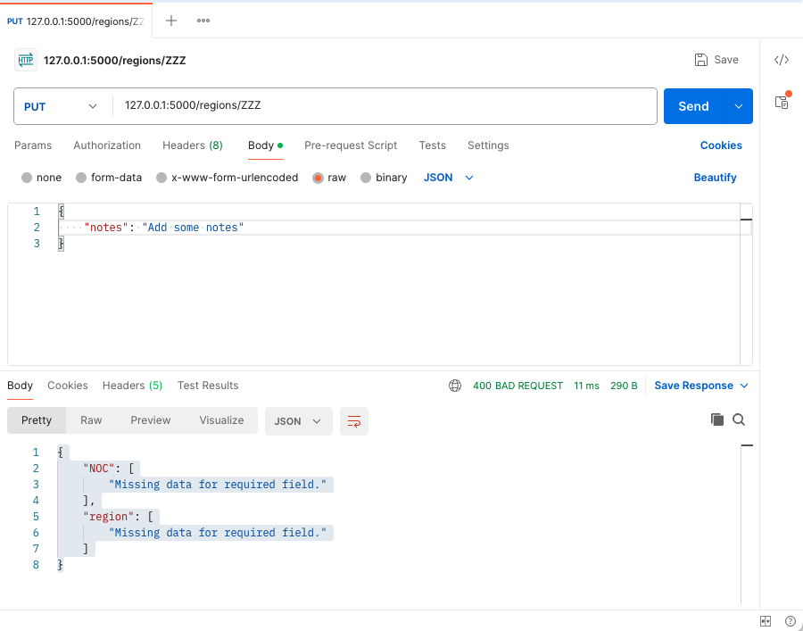
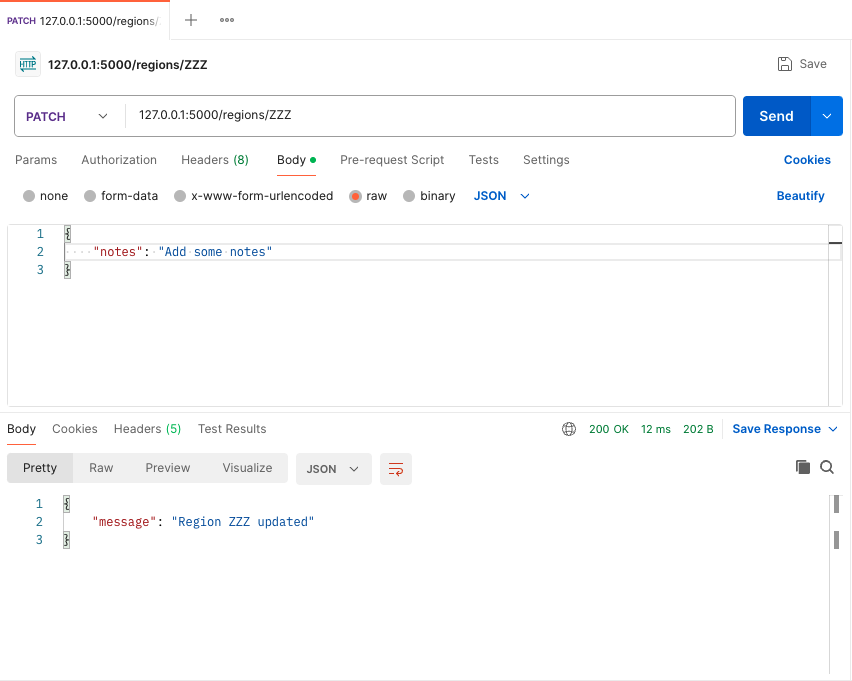

# PUT and PATCH routes

This file attempts to clarify the difference.

REST is a set of 'rules' as to how an API should behave.

The 'rules' for PUT and PATCH are:

- PUT:
    - Used to update a resource or create a new resource if it does not exist.
    - The entire resource is replaced with the new data.
    - If the resource does not exist, it will be created.
- PATCH:
    - Used to partially update a resource.
    - Useful when you want to update only a few fields of a resource without replacing the entire resource.
    - Specify the fields that need to be updated in the request body.

Flask receives the HTTP method in the request. There is nothing I found in the Flask documentation to suggest that the
method applies any logic to the request.

How your app handles the request is therefore up to you to implement it the logic.

Here is an alternative for the update_region() that handles either PUT or PATCH and uses the Marshamall-SQAlchemy schema
to validate whether all fields have to be provided or only some:

```python
@app.route("/regions/<noc_code>", methods=['PUT', 'PATCH'])
def region_update(noc_code):
    """

    Updates changed fields for the region in accordance with the method received.

    PUT:
        - Used to update a resource or create a new resource if it does not exist.
        - The entire resource is replaced with the new data.
        - If the resource does not exist, it will be created.
    PATCH:
        - Used to partially update a resource.
        - Useful when you want to update only a few fields of a resource without replacing the entire resource.
        - Specify the fields that need to be updated in the request body.

    """

    # Find the region in the database
    existing_region = db.session.execute(
        db.select(Region).filter_by(NOC=noc_code)
    ).scalar_one_or_none()

    # Get the updated details from the json sent in the HTTP patch request
    region_json = request.get_json()

    # Use Marshmallow to update the existing records with the changes from the json
    if request.method == 'PATCH':
        r = region_schema.load(region_json, instance=existing_region, partial=True)
    if request.method == 'PUT':
        # If the region exists, update it
        if existing_region:
            try:
                r = region_schema.load(region_json, instance=existing_region)
            except ValidationError as err:
                return err.messages, 400
        else:
            # If it doesn't exist add a new region if all the necessary field values are provided
            try:
                r = region_schema.load(region_json)
                return {"message": f"Region added with NOC= {noc_code}"}
            except ValidationError as err:
                return err.messages, 400

    # Commit the changes to the database
    db.session.add(r)
    db.session.commit()

    return {"message": f"Region {noc_code} updated"}
```

If you then use a tool like postman to test a partial update, then trying a partial update with PUT now fails and PATCH
works:





Another approach if you are not using Marshmallow schemas for validation, is to use the SQLAlchemy object which I think would be
something like the following code (code not tested so there could be an error!):

```python
@app.route("/regions/<noc_code>", methods=['PUT', 'PATCH'])
def region_update(noc_code):
    # Note: There is no error handling in the solution below. Week 5 focuses on error handling.

    # Find the region in the database
    existing_region = db.session.execute(db.select(Region).filter_by(NOC=noc_code)).scalar_one_or_none()

    # Get the updated details from the json sent in the HTTP patch request
    region_json = request.get_json()

    # If the method of the request is PATCH, then loop through all the JSON and update the any of the fields found
    if request.method == 'PATCH':
        for key, value in region_json.items():
            existing_region.key == value
        db.session.add(existing_region)
    if request.method == 'PUT':
        # If the method is PUT and an existing region is found, update all mandatory fields
        if existing_region:
            existing_region.NOC = region_json['NOC']
            existing_region.region = region_json['region']
            if region_json['notes']:
                existing_region.notes = region_json['notes']
            db.session.add(existing_region)
        else:
            # If the region is not found, then add a new record
            new_region = Region(NOC=region_json['NOC'], region=region_json['region'],
                                notes=region_json['notes'] or None)
            db.session.add(new_region)

    # Commit the changes to the database
    db.session.commit()

    return {"message": f"Region {noc_code} updated"}

```

